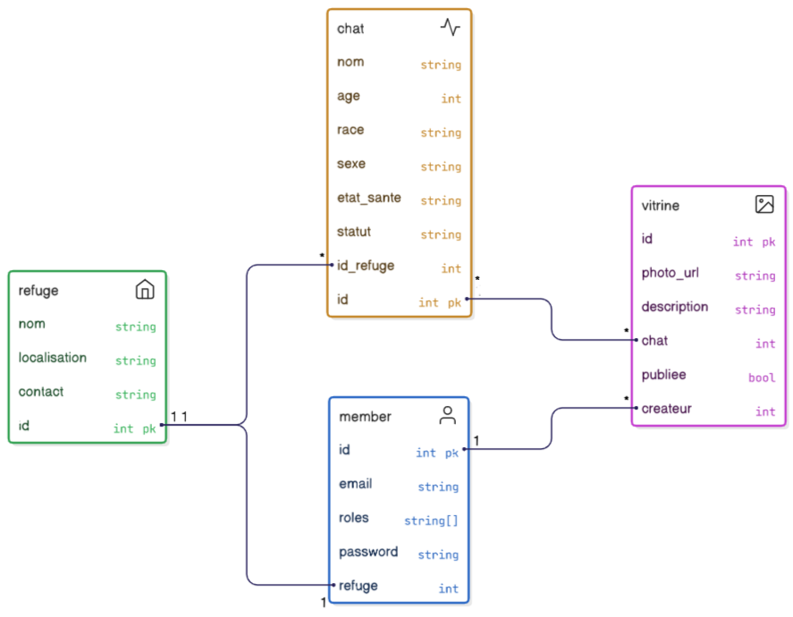

#  PurrHome

**Projet Symfony – Application de gestion d’un refuge de chats**
---
###  Thème
Gestion d’un refuge de chats — *Application PurrHome*

---

##  Présentation générale

**PurrHome** est une application **Symfony** dédiée aux refuges et aux passionnés de chats.  
Elle permet de :

- Gérer les chats disponibles à l’adoption.  
- Présenter leurs profils dans des vitrines d’adoption.  
- Faciliter les interactions entre refuges, adoptants et bénévoles.

### Objectifs du projet
- **Centraliser** les informations des refuges et de leurs chats.  
- **Offrir** une vitrine numérique pour promouvoir l’adoption.  

---

## Domaine fonctionnel

| Nom logique | Entité réelle | Description |
|--------------|----------------|--------------|
| `objet` | **Chat** | Représente un chat à adopter ou déjà adopté. |
| `inventaire` | **Refuge** | Contient la liste des chats gérés par un refuge. |
| `galerie` | **Vitrine** | Présente des photos et descriptions d’un chat. |
| `member` | **Member** | Personne adoptante ou bénévole. |

---

##  Contrôleurs et Routes créées

###  RefugeController (`/refuge`)
**Nom interne :** `RefugeController` *(lié à [inventaire])*

**Fichier :** `src/Controller/RefugeController.php`

#### Routes :
- `GET /refuge`  
  → Affiche la liste de tous les refuges.  
  **But :** Consultation générale de l’inventaire des refuges.

- `GET /refuge/{id}`  
  → Affiche le détail d’un refuge et la liste des chats qui y sont hébergés.  
  **But :** Permet de visualiser les chats d’un refuge précis.

---

###  ChatController (`/chat`)
**Nom interne :** `ChatController` *(lié à [objet])*

#### Routes :
- `GET /chat`  
  → Affiche tous les chats (adoptés ou disponibles).

- `GET /chat/{id}`  
  → Détail d’un chat précis.

---

##  Diagramme UML



---

##  Instructions d’installation et d’exécution

###  Étape 1 — Extraire le projet

Décompressez l’archive dans un répertoire de travail.  
**Exemples :**
```bash
# Windows
C:\Users\<votre_nom>\rendu-CSC4101\mycat

# Linux / macOS
/home/<votre_nom>/rendu-CSC4101/mycat
